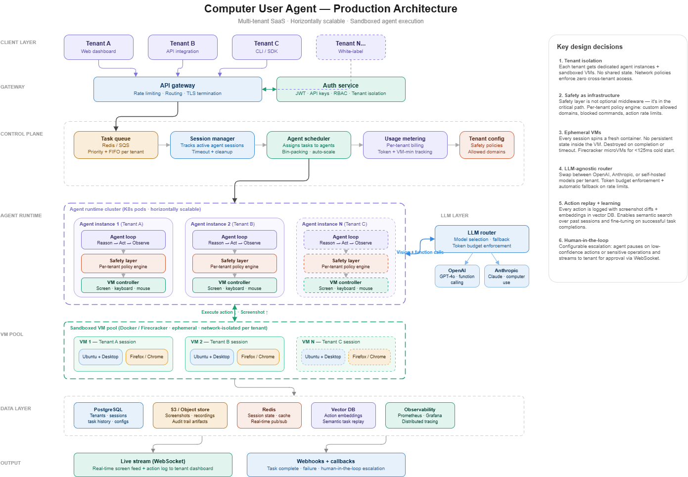

# Computer User Agent — Production Platform

**Autonomous AI agents that control real desktops to complete browser tasks — no hardcoded workflows.**

An agent sees the screen, reasons about what to do next, and acts. Click, type, scroll, read results — all driven by vision + LLM function calling inside sandboxed Docker containers.



---

## Demo

```bash
# One command. Watch the agent work in VNC (localhost:5900).
python run_local.py -m "go to google.com and search for AI startups hiring in SF"
```

---

## Why This Exists

Every business still has humans doing repetitive browser tasks — filling forms, pulling reports, navigating legacy portals with no API. Current automation tools (Selenium, Playwright, RPA) require hardcoded workflows that break when the UI changes.

This platform gives an AI agent a real browser and lets it figure out the steps autonomously. No selectors, no scripts, no brittle workflows.

---

## Architecture

```
Tenants (A, B, C, N)
        │
  API Gateway ──── Auth (JWT + API Keys)
        │
  Control Plane ── Task Queue (Redis) ─ Scheduler ─ Billing
        │
  Agent Runtime ── Agent Loop → Safety Layer → VM Controller ↔ LLM Router
   (per tenant)        │                                        ├─ OpenAI
        │              │                                        └─ Anthropic
  VM Pool ──────── Ephemeral Docker (Ubuntu + Firefox, network-isolated)
        │
  Data Layer ──── PostgreSQL ─ Redis ─ S3 ─ Prometheus
```

**Key design decisions:**

| Decision | Why |
|----------|-----|
| **Safety layer in the critical path** | Every action validated before it touches the VM — domain allowlists, risky text detection, dangerous key blocking |
| **Ephemeral VMs** | Fresh container per session, destroyed on completion. Zero persistent state inside sandbox |
| **Tenant isolation** | Dedicated agent instances + network-isolated VMs per tenant. No shared state |
| **LLM-agnostic router** | Swap OpenAI/Anthropic per tenant. Automatic fallback on failure |
| **Audit trail** | Every action + screenshot stored in S3. Full replay capability |

---

## Quick Start

### Local Demo Mode (watch via VNC)

```bash
# 1. Clone and setup
git clone https://github.com/tchalikanti1705/computer-use-agent-prod.git
cd computer-use-agent-prod
cp .env.example .env        # add your OPENAI_API_KEY

# 2. Build the sandbox
cd sandbox && docker build -t cua-sandbox:latest . && cd ..

# 3. Install dependencies
pip install -r requirements.txt

# 4. Run
python run_local.py -m "search for weather in new york"

# 5. Open VNC viewer at localhost:5900 (password: secret) and watch!
```

### Production Mode (multi-tenant API)

```bash
# Start infrastructure
docker compose up -d postgres redis minio

# Run migrations
python -m scripts.migrate

# Start services (3 terminals)
uvicorn gateway.app:app --port 8000          # API Gateway
uvicorn control_plane.app:app --port 8001    # Scheduler
python -m agent_runtime.worker               # Agent Worker

# Create tenant + submit task
curl -X POST http://localhost:8000/api/v1/tenants \
  -H "Content-Type: application/json" \
  -d '{"name":"acme","email":"admin@acme.com","allowed_domains":["google.com","wikipedia.org"]}'

# Use the returned api_key:
curl -X POST http://localhost:8000/api/v1/tasks \
  -H "Authorization: Bearer cua_<your_key>" \
  -H "Content-Type: application/json" \
  -d '{"instruction":"Go to google.com and search for hiring trends in AI"}'
```

---

## Project Structure

```
├── gateway/                 # API Gateway + Auth (FastAPI)
│   ├── app.py               # Routes: tenants, tasks, WebSocket stream
│   ├── auth.py              # JWT + API key validation
│   └── middleware.py        # Rate limiting per tenant
│
├── control_plane/           # Task scheduling + session management
│   ├── scheduler.py         # Redis queue → worker assignment
│   ├── session_manager.py   # Active session tracking + TTL cleanup
│   └── billing.py           # Per-tenant usage metering
│
├── agent_runtime/           # Core agent engine
│   ├── agent_loop.py        # Reason → Safety → Act → Observe → Repeat
│   ├── worker.py            # Long-running worker (pulls from Redis queue)
│   ├── safety/
│   │   ├── engine.py        # Per-tenant policy engine
│   │   └── policies.py      # Domain allowlists, risky keywords, key blocking
│   ├── vm/
│   │   ├── controller.py    # Docker exec: keyboard, mouse, screenshots
│   │   ├── pool.py          # Ephemeral container lifecycle
│   │   └── sandbox.py       # Session start/stop orchestration
│   ├── llm/
│   │   ├── router.py        # Provider selection + automatic fallback
│   │   └── providers.py     # OpenAI + Anthropic implementations
│   └── streaming/
│       └── publisher.py     # Redis pub/sub → WebSocket live stream
│
├── sandbox/                 # VM Docker image (Ubuntu + Firefox + XFCE)
├── shared/                  # Config, DB, Redis, S3, observability
├── migrations/              # PostgreSQL schema
├── tests/                   # Safety + model tests
├── run_local.py             # CLI mode for demos
└── docker-compose.yml       # Full stack: Postgres, Redis, MinIO, services
```

---

## Agent Loop — How It Works

```
User: "search for AI jobs in San Francisco"
                    │
    ┌── Step 0: Screenshot fresh desktop ──────────────┐
    │   Send to LLM: "here's what I see + instruction" │
    │   LLM returns: click(x=640, y=400)               │
    │   Safety: click → APPROVED                        │
    │   Execute on VM via xdotool                       │
    └──────────────────────────────────────────────────┘
                    │
    ┌── Step 1: New screenshot ────────────────────────┐
    │   LLM: type("google.com") + keypress(Enter)      │
    │   Safety: URL check → google.com in allowlist ✓   │
    │   Execute                                         │
    └──────────────────────────────────────────────────┘
                    │
    ┌── Step 2: New screenshot (Google loaded) ────────┐
    │   LLM: type("AI jobs in SF") + Enter              │
    │   Safety: text check → no risky keywords ✓        │
    │   Execute                                         │
    └──────────────────────────────────────────────────┘
                    │
    ┌── Step 3: New screenshot (results page) ─────────┐
    │   LLM reads results, returns final answer         │
    │   No more actions → TASK COMPLETE                 │
    └──────────────────────────────────────────────────┘

Result: "I found several AI job listings in SF..."
Total: 4 steps, ~2000 tokens, 45 seconds
```

---

## Safety Layer

The safety engine sits in the **critical path** — no action reaches the VM without passing through it.

```python
# Per-tenant policy enforcement
safety = SafetyEngine("tenant-123", {
    "allowed_domains": ["google.com", "linkedin.com"],
    "require_human_approval": False,
})

# Every action validated
verdict = safety.validate_action({"type": "type", "text": "https://evil.com"})
# → SafetyVerdict(allowed=False, reason="Domain not allowed: evil.com")

verdict = safety.validate_action({"type": "keypress", "keys": ["alt", "F4"]})
# → SafetyVerdict(allowed=False, reason="Alt+F4 blocked")
```

---

## Tests

```bash
python -m pytest tests/ -v
# 10 passed — safety, models, URL validation, batch limits
```

---

## Tech Stack

| Layer | Tech |
|-------|------|
| API Gateway | FastAPI, JWT, API Keys |
| Task Queue | Redis (sorted set with priority) |
| Agent Runtime | Python, OpenAI Responses API, Anthropic Claude |
| VM Control | Docker, xdotool, ImageMagick, XFCE |
| Database | PostgreSQL, SQLAlchemy |
| Cache / Pub-Sub | Redis |
| Object Storage | S3 / MinIO |
| Observability | Prometheus, structlog |

---

## License

MIT
